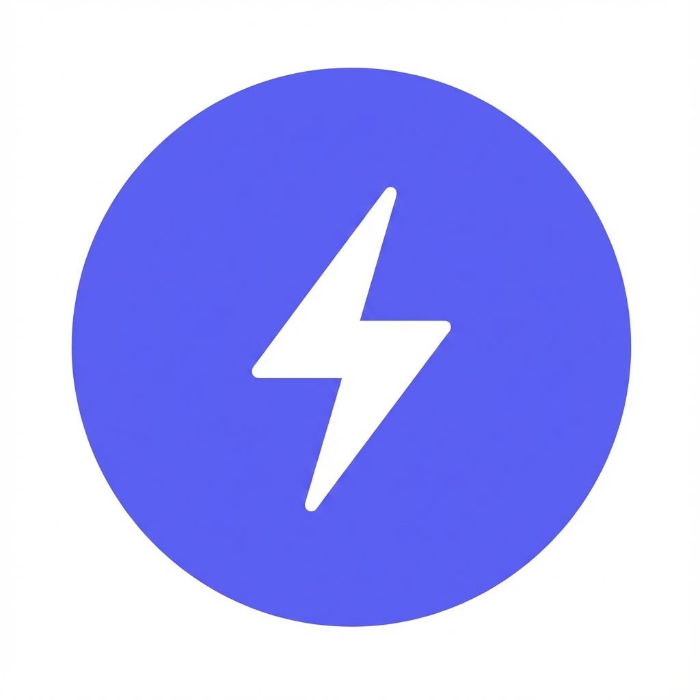

# Vibe • Social Community & Reels Platform
<p align="center">
  
</p>

## ✨ Experience the Future of Connection
**Vibe** is a high-performance, social media application designed for the next generation of creators. Built with **React Native (Expo)** and powered by a real-time backend, Vibe offers a seamless, cinematic experience for sharing, watching, and connecting.

---

## 📽️ Core Features
- **Cinematic Reels**: Immersive, vertical video feed for creative expressions.
- **Real-time Connectivity**: Instant messaging and live updates powered by **Socket.io**.
- **Social Feed**: Interactive posts with support for images, videos, and complex engagement.
- **Dynamic Profile**: Personalized user profiles with showcase for content and interests.
- **Secure Authentication**: Robust user management for a safe community experience.
- **Global Presence**: Full localization support (i18n) for international users.
- **Smart Notifications**: Stay in the loop with relevant triggers and alerts.

---

## 🚀 Technology Stack
| Front-end | Back-end | Extras |
| :--- | :--- | :--- |
| **Expo / React Native** | **Node.js / Express** | **Socket.io** (Real-time) |
| **Reanimated** (Smooth UI) | **MongoDB** (Database) | **Firebase** (Cloud Services) |
| **Expo Router** (Navigation) | **JWT** (Security) | **i18next** (Localization) |
| **Lucide Icons** | **Zustand / Redux** | **Expo AV / Video** |

---

## 🛠️ Setup & Installation

### 1. Project Prerequisites
Ensure you have the following installed:
- [Node.js](https://nodejs.org/) (LTS)
- [npm](https://www.npmjs.com/) or [yarn](https://yarnpkg.com/)
- [Expo Go](https://expo.dev/go) app (on your iOS or Android device)

### 2. Backend Initialization
```bash
cd backend
npm install
npm run dev
```

### 3. Mobile Frontend Setup
```bash
npm install
npx expo start
```
*Note: Scan the QR code with your camera (iOS) or Expo Go app (Android) to explore Vibe.*

---

## 📄 License
This project is private and for internal development use.

---

<p align="center">
  Built with ❤️ by <b>Yassine Roummani</b><br/>
  <i>Connecting hearts through digital vibes.</i>
</p>
